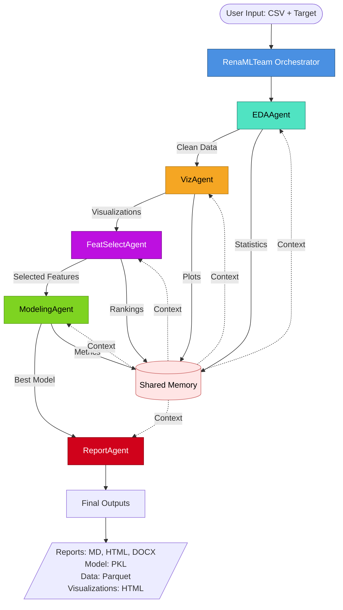
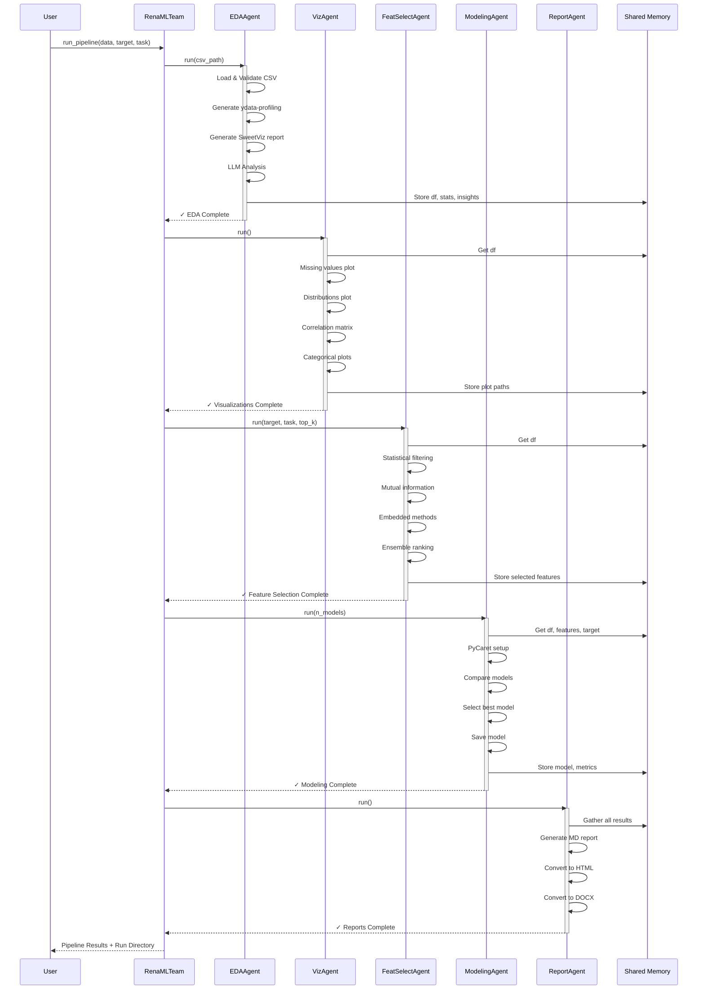

# RenaML - Automated Machine Learning Pipeline

> An intelligent, agent-based AutoML framework that orchestrates the complete machine learning lifecycle from data ingestion to model prediction.

[](https://www.python.org/)
[](LICENSE)
[](https://github.com/astral-sh/ruff)

## Overview

RenaML is a proof-of-concept automated machine learning pipeline built on a multi-agent architecture. Each specialized agent handles a specific phase of the ML workflow, collaborating through shared memory to deliver comprehensive end-to-end automation—from data exploration to model training and reporting.

### Key Features

- **Agent-Based Architecture**: Modular, specialized agents that work collaboratively
- **Automated EDA**: Comprehensive exploratory data analysis with ydata-profiling and SweetViz
- **Intelligent Feature Selection**: Multiple statistical and ML-based feature selection methods
- **AutoML Integration**: Automated model training and comparison using PyCaret
- **Rich Visualizations**: Interactive Plotly charts for data insights
- **Comprehensive Reporting**: Auto-generated reports in Markdown, HTML, and DOCX formats
- **Full Pipeline Tracking**: Detailed logging and artifact management for reproducibility

## Architecture

### Design Philosophy

RenaML follows a **multi-agent orchestration pattern** where each agent is an autonomous unit with:

- **Single Responsibility**: Each agent focuses on one specific task
- **Shared Memory**: Agents communicate through a centralized memory dictionary
- **LLM-Augmented**: Agents leverage GPT-4 for intelligent analysis and insights
- **Modular Design**: Easy to extend, customize, or replace individual agents

### System Architecture



### Pipeline Flow



### Agent Responsibilities

| Agent | Purpose | Key Technologies | Outputs |
|-------|---------|------------------|---------|
| **EDAAgent** | Data ingestion, validation, and exploratory analysis | pandas, ydata-profiling, SweetViz, GPT-4 | `data_clean.parquet`, EDA reports |
| **VizAgent** | Interactive visualization generation | Plotly, matplotlib, seaborn | HTML interactive charts |
| **FeatSelectAgent** | Intelligent feature selection | scikit-learn, mutual_info, embedded methods | Feature rankings JSON |
| **ModelingAgent** | AutoML model training and evaluation | PyCaret, scikit-learn, LightGBM, XGBoost | Best model PKL, metrics JSON |
| **ReportAgent** | Consolidated report generation | python-docx, Jinja2, Markdown | MD, HTML, DOCX reports |

### Architecture Decisions

#### 1. **Agent-Based Orchestration**
**Decision**: Use specialized agents instead of monolithic pipeline  
**Rationale**:
- **Modularity**: Each agent can be developed, tested, and maintained independently
- **Scalability**: Easy to add new agents or remove existing ones
- **Clarity**: Clear separation of concerns improves code readability
- **Reusability**: Agents can be reused in different pipeline configurations

#### 2. **Shared Memory Pattern**
**Decision**: Centralized dictionary for inter-agent communication  
**Rationale**:
- **Simplicity**: Easier than implementing message queues or complex pub/sub
- **Transparency**: All agents have visibility into previous steps
- **Flexibility**: Agents can access any needed context without tight coupling
- **POC Appropriate**: Sufficient for single-machine, sequential execution

#### 3. **LLM-Augmented Analysis**
**Decision**: Integrate GPT-4 for intelligent insights at each stage  
**Rationale**:
- **Contextual Understanding**: LLMs provide human-like interpretation of data patterns
- **Automated Documentation**: Natural language explanations of findings
- **Adaptive Reasoning**: Can handle diverse datasets without hardcoded rules
- **Enhanced UX**: Users get actionable insights, not just numbers

#### 4. **PyCaret for AutoML**
**Decision**: Use PyCaret as the primary AutoML framework  
**Rationale**:
- **Low-Code Interface**: Simplifies model comparison and training
- **Comprehensive**: Supports classification, regression, clustering, etc.
- **Battle-Tested**: Mature library with extensive model support
- **Trade-off**: Requires Python ≤3.11 (documented constraint)

#### 5. **Prompt Organization Strategy**
**Decision**: Separate prompt files from agent logic  
**Rationale**:
- **Maintainability**: Easier to iterate on prompts without touching code
- **Collaboration**: Prompt engineers can work independently from developers
- **Version Control**: Better tracking of prompt changes
- **Testing**: Facilitates A/B testing of different prompt strategies

#### 6. **Output Artifacts Structure**
**Decision**: Time-stamped run directories with categorized subdirectories  
**Rationale**:
- **Reproducibility**: Each run is fully self-contained
- **Traceability**: Easy to compare results across different runs
- **Organization**: Logical grouping (eda/, models/, visualizations/, etc.)
- **No Overwrites**: Historical runs are preserved automatically

## Quick Start

### Prerequisites

⚠️ **Important**: This project requires **Python 3.9, 3.10, or 3.11**.  
PyCaret is not compatible with Python 3.12+.

### Installation

```bash
# 1. Verify Python version
python --version  # Must be 3.9.x, 3.10.x, or 3.11.x

# 2. Clone the repository
git clone https://github.com/PJarbas/RenaML.git
cd RenaML

# 3. Create virtual environment
python3 -m venv .venv
source .venv/bin/activate  # Linux/Mac
# or
.venv\Scripts\activate  # Windows

# 4. Install dependencies
pip install -r requirements.txt
```

### Basic Usage

```bash
# Run with default configuration (uses data/input.csv)
python main.py
```

### Advanced Usage (CLI)

```bash
# Run complete pipeline with custom parameters
python -m src.agno_team \
    --data data/input.csv \
    --target species \
    --task classification \
    --top-k 20 \
    --n-models 5
```

### CLI Parameters

| Parameter | Description | Required | Default |
|-----------|-------------|----------|---------|
| `--data` | Path to input CSV file | Yes | - |
| `--target` | Target column name | Yes | - |
| `--task` | Task type: `classification` or `regression` | No | `classification` |
| `--run-id` | Custom run identifier | No | `run_YYYYMMDD_HHMMSS` |
| `--top-k` | Number of features to select | No | `20` |
| `--n-models` | Number of models to compare | No | `5` |
| `--out-root` | Root directory for outputs | No | `runs` |

## Project Structure

```
RenaML/
├── data/
│   └── input.csv                    # Input datasets
├── src/
│   ├── agents/                      # Agent implementations
│   │   ├── eda_agent.py            # Data exploration
│   │   ├── viz_agent.py            # Visualization generation
│   │   ├── featselect_agent.py     # Feature selection
│   │   ├── modeling_agent.py       # Model training
│   │   └── report_agent.py         # Report generation
│   ├── prompts/                     # LLM prompts (separated from logic)
│   │   ├── eda_agent_prompts.py
│   │   ├── featselect_agent_prompts.py
│   │   ├── modeling_agent_prompts.py
│   │   ├── viz_agent_prompts.py
│   │   └── report_agent_prompts.py
│   ├── tools/                       # Utility functions
│   └── agno_team.py                # Main orchestrator
├── runs/                            # Pipeline execution outputs
│   └── run_YYYYMMDD_HHMMSS/
│       ├── data_clean.parquet      # Processed data
│       ├── eda/                    # EDA reports
│       ├── visualizations/         # Interactive plots
│       ├── feature_selection/      # Feature rankings
│       ├── models/                 # Trained models
│       ├── report.{md,html,docx}  # Final reports
│       └── pipeline.log            # Execution logs
├── requirements.txt                 # Python dependencies
├── pyproject.toml                  # Project configuration (Ruff)
├── Dockerfile                      # Container configuration
└── README.md
```

## Generated Outputs

Each pipeline execution creates a timestamped directory `runs/run_{timestamp}/` containing:

### Data Artifacts
- **`data_clean.parquet`**: Validated and processed dataset in Parquet format

### EDA Reports
- **`eda/ydata_profile.html`**: Comprehensive automated profiling report
- **`eda/sweetviz_report.html`**: Visual EDA with target analysis

### Visualizations
- **`visualizations/missing_values.html`**: Missing data patterns
- **`visualizations/distributions.html`**: Numerical feature distributions
- **`visualizations/correlation_matrix.html`**: Feature correlations heatmap
- **`visualizations/categorical_distributions.html`**: Categorical feature analysis

### Feature Selection
- **`feature_selection/feature_selection_report.json`**: Rankings and scores from multiple methods

### Models
- **`models/best_classification_model.pkl`** (or `regression`): Serialized best model
- **`models/models_summary.json`**: Performance comparison of all models

### Reports
- **`report.md`**: Markdown report with all findings
- **`report.html`**: HTML version (web-viewable)
- **`report.docx`**: Microsoft Word document

### Logs
- **`pipeline.log`**: Complete execution trace with timestamps

## Technology Stack

### Core Framework
- **Python 3.9-3.11**: Language runtime (PyCaret constraint)
- **Agno Framework**: Multi-agent orchestration

### Machine Learning
- **PyCaret**: AutoML framework for model training
- **scikit-learn**: Feature selection and preprocessing
- **LightGBM / XGBoost**: Gradient boosting algorithms
- **pandas**: Data manipulation
- **numpy**: Numerical computing

### Data Analysis
- **ydata-profiling**: Automated data profiling
- **SweetViz**: Visual exploratory data analysis

### Visualization
- **Plotly**: Interactive visualizations
- **Matplotlib**: Static plots
- **Seaborn**: Statistical visualizations

### LLM Integration
- **OpenAI GPT-4**: Intelligent analysis and insights

### Reporting
- **python-docx**: Word document generation
- **Markdown**: Report formatting
- **Jinja2**: Template engine

## Docker Support

### Building the Image

```bash
docker build -t renaml-poc .
```

### Running the Pipeline

```bash
# Run with mounted volumes for data and outputs
docker run \
    -v $(pwd)/data:/app/data \
    -v $(pwd)/runs:/app/runs \
    renaml-poc \
    --data /app/data/input.csv \
    --target species \
    --task classification
```

## Extending RenaML

### Adding a New Agent

1. **Create agent file** in `src/agents/new_agent.py`:

```python
import logging
from pathlib import Path
from typing import Any, Dict

class NewAgent:
    """Custom agent for specific task."""
    
    def __init__(self, team_memory: Dict[str, Any], run_dir: Path):
        self.team_memory = team_memory
        self.run_dir = run_dir
        self.logger = logging.getLogger(__name__)
    
    def run(self, **kwargs) -> Dict[str, Any]:
        """Execute agent logic."""
        try:
            # Implement your logic here
            
            # Store results in shared memory
            self.team_memory['new_agent_results'] = {...}
            
            return {
                'status': 'success',
                'results': {...}
            }
        except Exception as e:
            self.logger.error(f"Error in agent: {e}", exc_info=True)
            return {'status': 'error', 'error': str(e)}
```

2. **Register** in `src/agents/__init__.py`:

```python
from .new_agent import NewAgent

__all__ = ['EDAAgent', 'VizAgent', 'FeatSelectAgent', 
           'ModelingAgent', 'ReportAgent', 'NewAgent']
```

3. **Integrate** into `RenaMLTeam` in `src/agno_team.py`:

```python
# In __init__
self.agents = {
    'eda': EDAAgent(self.memory, self.run_dir),
    'viz': VizAgent(self.memory, self.run_dir),
    'featselect': FeatSelectAgent(self.memory, self.run_dir),
    'modeling': ModelingAgent(self.memory, self.run_dir),
    'report': ReportAgent(self.memory, self.run_dir),
    'new_agent': NewAgent(self.memory, self.run_dir),
}

# In run_pipeline
results['new_agent'] = self.agents['new_agent'].run()
```

### Customizing Prompts

Prompts are organized in `src/prompts/` for easy customization:

```python
# src/prompts/my_agent_prompts.py
AGENT_INSTRUCTIONS = """
You are an expert in [domain].
Your task is to [specific task].
"""

ANALYSIS_PROMPT = """
Analyze the following data:
{data}

Provide insights on:
1. [Insight type 1]
2. [Insight type 2]
"""
```

**Benefits of Prompt Separation:**
- ✅ Version control for prompt engineering
- ✅ Easy A/B testing of different prompts
- ✅ Clear separation of concerns
- ✅ Collaborative workflow between developers and prompt engineers
